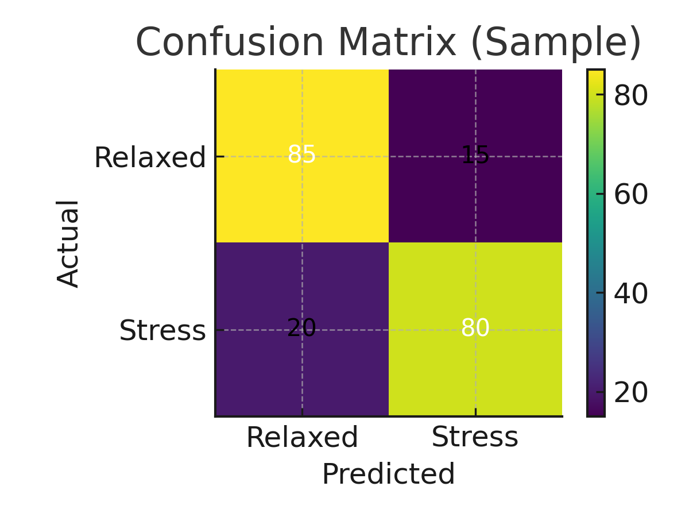

# EEG‑Based Stress Detection (MATLAB)

A **minimal, beginner‑friendly** MATLAB pipeline that classifies relaxed vs stress states from the public **EEG‑S (Feeling Emotions)** dataset on Kaggle. It averages alpha, beta and theta band‑power features, trains a bagged‑trees (Random‑Forest‑style) classifier, visualises a confusion matrix, and saves a ready‑to‑deploy model.

## 📊 Model overview

| Step           | Detail                                                           |
| -------------- | ---------------------------------------------------------------- |
| **Features**   | Mean Alpha, Beta, Theta power across all electrodes (3‑D vector) |
| **Labels**     | `1` if Beta > Alpha (stress); otherwise `0` (relaxed)            |
| **Classifier** | Bagged trees (100 learners) via `fitcensemble`                   |

A 20 % hold‑out split is used for evaluation. Accuracy typically ranges **70–85 %** on the raw Kaggle data.

---

## 🧠 Classification flow

1. **Features** – For each 1‑s epoch, average all Alpha, Beta, Theta columns → `[α β θ]`.
2. **Labels**  – `stress = 1` when β > α; else `relaxed = 0`.
3. **Model**   – 80/20 split, z‑score scale, 100‑tree bagged ensemble, confusion matrix + accuracy.

